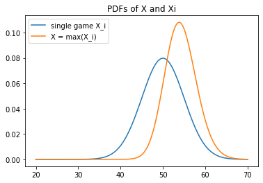

# Fantasy Basketball Analysis
## Using probability and statistics to turn fantasy into science
## Author: William Lusty, Georgia Tech School of Math
### 1. Intro (in progress)
Fantasy sports are a popular form of entertainment globally.
### 2. Sleeper and Lock-in Mode
Sleeper is a fantasy sports app that is relatively new to the market. They offer a simple to use platform that is particuarly popular for fantasy basketball. In October 2022, Sleeper announced a new fantasy basketball mode called "Lock-In Mode" which revolutionizes the way the game is played. 

The prevalent game mode previously had users pick a single game per week that would be counted for the team's total score. This would typically be done at the start of every week before the games had been played. For example, if Lebron James was playing Phoenix, Boston, and Portland this upcoming week and I had him on my team, if I predicted that Lebron would be able to score many points against Portland's defense, I might pick to count the Lebron's Portland game to count for my team this week. 

Lock-in Mode, however, has users choose after every game that a player plays whether or not they would like for that game to count for their team every week. For example, suppose that Luka Doncic is on my team and plays Houston, San Antonio, and Miami this week. Let's say that Luka generates 51 fantasy points against Houston in the first game of the week. I know have a decision, either lock in those 51 fantasy points to count for my team this week or to leave the points unlocked, risking the sure points on the chance that he will produce more in one of the next two games.

Lock-in mode has several different advantages over the old methods of playing fantasy basketball. Firstly, as a user, many more games each week have implications on the success of my team. With the old "pick" mode, only one game per player per week has an affect on the success of my team. With lock-in mode, every game of every player on my team that doesn't have their points locked in yet could give be a chance for a player to produce. Secondly, Lock-in Mode generates a much higher usage rate for the Sleeper app than traditional pick mode. With pick mode, players effectively "set it and forget it", since they can pick their games at the start of the week and there are no more decisions to be made. With lock-in mode, however, users who wish to maximize their team's points must check the app every day to see if any of their players had high-production games that should be locked in. Finally, a team's bench players can be utilized a lot more in lock-in mode. If one of my starters is not playing on a given night (and their points haven't been locked in yet), there is no reason why I shouldn't temporarily put them on the bench in favor of someone who is playing tonight on the chance that the bench player will have a highly productive game that could be locked in.

This discussion of lock-in mode versus the old game picking modes leads us to the motivation of this project. 

### 3. Motivation
Lock-in mode has made fantasy basketball more fun and exciting this season for the reasons discussed above. Although the new game mode was easy to understand, some of the subleties of the new game mode created opportunities for players to explore different strategies for playing the game. At the start of the season, players in our league were playing like it was still in pick mode and being punished by other players who had adapted their strategies faster. For example, in pick mode, many players would be happy if their non stars, their rotation players, could reliable create 20-25 fantasy points. This led some players this year to lock in games at these levels without realizing the probability that some other player on the bench will probably beat those numbers with some patience and smart daily rotations.  This means that games are much higher scoring with this mode because players are supposed to choose high outlier games. 

It has been fun for me, as a student of probability and statistics, to mentally study the effects that this new game mode has had on the league this season. It has also led me to adjust some of my strategies for drafting and picking up players to my team. For example, I have convinced myself that lock-in mode rewards more highly variable players over consistent production players. This is because a more highly variable player is more likely to have some high outlier game this week that I will be able to lock in if I am patient. Another example has been my mental "baseline" for a "good" fantasy game has shifted upward from about 20-25 fantasy points per game to about 30-35 points per game. 

However, most of this modeling has been done mentally through trial and error. The goal of this project is to model Sleeper Fantasy Basketball Lock-in Mode using probability and statistics and see what insights and new strategies can be developed. I also aim to constantly compare and contrast lock-in mode and the traditional "pick" mode to see what kinds of strategies work for one versus the other (under certain mathematical assumptions). Finally, as an avid fantasy basketball user myself, I would like to develop methods of assessing and scoring players under the assumptions of my model so that I can make more intelligent decisions about who to trade for, draft, and acquire in free agency. Finally, I would like to develop heuristics to decide if and when to lock in a player's game in the middle of a matchup. 

### 4. Model
We will be using probability and statistical theory extensively in this investigation. The fundamental unit of a fantasy team is the player, so our investigation will begin there. Let $X_1, X_2, ..., X_n$ be the number of fantasy points a specific player produces in each of their $n$ games this week. In lock-in mode, as a manager, our goal should be to lock in every player's most highly productive game of the week. A relevant value, then, is the max of the $X_1, ..., X_n$ which we will denote $$X=\max{X_1, ..., X_n}. $$ The best way to evaluate the player in lock-in mode is by developing a sense of behavior for the variable $X$. Let us model the $X_1, ..., X_n$ as a sequence of random variables. The marginal distributions of the $X_i$ and the joint distribution of the sequence of games $X_1, ..., X_n$ will be a crucial point of discussion, but let's just put that aside for now. It follows that the variable $X$ is also a random variable since it is a function of the $n$ random variables $X_1, ..., X_n$. 

As always when we discuss random variables, our goal should be to characterize their behavior in terms of their probability density function (pdf) or cumulative density function (cdf). I will assume that the reader is familiar with these functions but let us note that once the pdf of a random variable is known, we can fully characterize the behavior of that random variable. Suppose that the cdfs and pdfs of the individual games $X_i$ are known to be $F_{X_i}(k) = \mathbb{P}(X_i \leq k)$ and $f_{X_i}(k) = F'_{X_i}(k)$. Now we would like to find either the pdf or the cdf of $X=\max{X_1, ..., X_n}$. Unfortunately, it is not easy to describe the pdf of the max of a set of random variables directly. However, we can observe that $$P(X \leq k) = P(X_1 \leq k \text{ and } X_2 \leq k \text{ and } ... \text{ and } X_n \leq k).$$ This helps us because we already know $P(X_i \leq k)$ for each $i$ but requires us to make our first assumption. 

#### Assumption: Independence
We will assume that each of a player's games are independent of one another. This is assumption shouldn't make us too uncomfortable but we will revisit this assumption later when we evaluate our model. 

Now back to the model. Using the independence assumption we can define the cdf of the variable $X$ $$F_X(k)=P(X_1 \leq k)P(X_2 \leq k) \cdot \cdot \cdot P(X_n \leq k) \\ = F_{X_1}(k)\cdot \cdot\cdot F_{X_n}(k)$$ This is good progress for the important random variable $X$, but we can make another assumption for the sake of modeling. 

#### Assumption: Identically Distributed $X_i$
We will assume some common distribution for each of the games $X_i$. This shouldn't make us too uncomfortable because in the real world, we know that the production of a given player in a game is somewhat inherent to the player. Of course, there are instances when a player might be expected to produce more against certain teams (Evan Fournier versus Boston in the 2021-2022 season, for example) but for the sake of modeling we will assume the probability distribution does not change for a given player in between their games. The intuitive explanation of this assumption is that the probability that a player produces a certain number of fantasy points (30, say) does not depend on the game that they're in. 

Again let's return to our model. We now have $F_{X_i}(k)$ is the same for every $i=1, 2, ..., n$ and so $$F_X(k) = P(X \leq k) = [F_{X_i}(k)]^n \\ = F_i^n(k).$$ Now is the time to make a choice for the distribution of a player's fantasy production in a given game.

#### Assumption: X_i are Normal. 
One reasonable choice for the distribution of the $X_i$ would be the normal distribution. One immediate concern of this choice is that the number of fantasy points in a given game by a player is inherently discrete, not continuous as a normal distribution would suggest. This is because the $X_i$ are typically given by a linear combination of the player's points, rebounds, assists, etc. which are discrete (integer) values. So why is it OK to model a discrete number with a continuous random variable? Well, in reality a more accurate model would be to say that the number of points, rebounds, and so on are binomial random variables and so the $X_i$ would be some linear combination of binomial variables. However, we know that as the number of trials in a binomial distribution grows large, the binomial pmf is well-approximated by a normal bell curve. This is illustrated below. 


```python
import matplotlib.pyplot as plt
from scipy.stats import binom
from scipy.stats import norm
import numpy as np
shots_attempted = 20
shot_make_pct = 0.57
made_shots_possible = range(0, 20)
x_normal_range = np.linspace(0, 20, 100)
shots_made_probs = binom.pmf(n=shots_attempted, p=shot_make_pct, k=made_shots_possible)
shots_made_probs_normal = norm.pdf(x_normal_range, loc=shots_attempted*shot_make_pct, scale = np.sqrt(shots_attempted * shot_make_pct * (1 - shot_make_pct)))
plt.stem(made_shots_possible, shots_made_probs, label="Binomial Predicted Probabilities", use_line_collection=True)
plt.plot(x_normal_range, shots_made_probs_normal, "purple", label="Normal Predicted Probabilities")
plt.legend()
plt.xlabel("Number of shots made")
plt.ylabel("Probability")
plt.show()
```


### Model (cont.)
Let us take a moment to recap. We are interested in the random variable $X=\max\{X_1, ..., X_n\}$ where the $X_i$ are i.i.d. Normal random variables. We have $X$ is the highest fantasy score of a player in the week and the $X_i$ are the fantasy scores in the individual games. Recall that the normal distribution is parameterized by two values: the mean and variance of the variable. These parameters will depend on the player in question so we will denote them $\mu_X$ and $\sigma^2_X$. With these parameters we can fully describe the behavior of the random variables $X_i$ with the pdf and cdf. Observe the pdf of $X_i$ is $$f_{X_i}(k)=\frac{1}{\sqrt{2\pi\sigma_X^2}}\exp(\frac{-1}{2\sigma_X^2}(k-\mu_X)^2)$$ and the cdf is $$F_{X_i}(k)= \frac{1}{2}[1+\text{erf}(\frac{k-\mu_X}{\sqrt{2\sigma^2_X}})]$$ where erf is the typical error function $\text{erf}(z)=\frac{2}{\sqrt{\pi}}\int_0^ze^{-t^2}dt$ Of course, we have not done any work to estimate these parameters $\mu_X$ and $\sigma^2_X$, but this we will examine later. The cdf of $X$ is therefore $$F_{X}(k)=F^n_{X_i}(k) \\ = \frac{1}{2^n}[1+\text{erf}(\frac{k - \mu_X}{\sqrt{2\sigma_X^2}})]^n.$$ The cdf is nice to have but we would really like to have the pdf of this random variable. We can obtain the pdf by differentiating with respect to $k$ as follows $$f_X(k)=\frac{d}{dk}F_X(k) \\ = \frac{n}{2^n}[1+\text{erf}(\frac{k - \mu_X}{\sqrt{2\sigma_X^2}})]^{n - 1}\frac{2}{\sqrt{\pi}}\exp(-\frac{(k-\mu_X)^2}{2\sigma_X^2})\frac{1}{\sqrt{2\sigma_X^2}} \\ = \frac{n}{2^{n - 1}\sqrt{2\pi\sigma_X^2}}\exp(-\frac{(k-\mu_X)^2}{2\sigma_X^2})[1+\text{erf}(\frac{k - \mu_X}{\sqrt{2\sigma_X^2}})]^{n - 1}$$
Although this pdf of $X$ is quite complicated we should be excited to have an exact analytic form for $f_X(k)$ since the behavior of this random variable can be exactly described now. Let us inspect the pdfs of $X_i$ and $X$, respectively.


```python
from scipy.special import erf
def pdf_max_normal(x, mu, var, n):
    toret = (x - mu) ** 2 / (2 * var)
    toret = np.exp(-1 * toret)
    toret *= (1 + erf((x - mu) / np.sqrt(2 * var))) ** (n - 1)
    toret *= n / (2 ** (n - 1) * np.sqrt(2 * np.pi * var))
    return toret
```


```python
def plot_pdf_X(mu, sigma, n, x=np.linspace(0, 50, 200)):
    x_normal = norm.pdf(x, mu, sigma)
    x_max_normal = pdf_max_normal(x, mu, sigma ** 2, n)
    plt.plot(x, x_normal, label="single game X_i")
    plt.plot(x, x_max_normal, label="X = max(X_i)")
    plt.title("PDFs of X and Xi")
    plt.legend()
    plt.show()
plot_pdf_X(mu=25, sigma=5, n=3)
```


#### Fantastic!
We should be very excited to see the pdf of the crucial variable $X$ meets some of the expectations we had for it. Intuitively, the mean of this distribution is greater than the mean of the single game distribution. Let's play around with some of the parameters in the distribution.


```python
#Doubling the number of games to 6
plot_pdf_X(mu=25, sigma=5, n=6)
```


```python
# Doubling the standard deviation to 10
plot_pdf_X(mu=25, sigma=10, n=3)
```


```python
# Doubling the mean to 50
plot_pdf_X(mu=50, sigma=5, n=3, x = np.linspace(20, 70, 200))
```





#### Observations: 
The max of a weekly set of scores is not highly sensitive to the number of games played. Changes to $\mu_X$ seem to shift both curves equally. However, the peak of the pdf seems to be sensitive to changes in $\sigma_X^2$. To investigate these relationships further, let us develop several methods of comparing or scoring these distributions. 

#### Metrics for Players
In fantasy, the number that matters is tha max of a player's scores in a given week, i.e. the $X$ variable. The $X$ variable is parameterized by $\mu_X, \sigma^2_X, \text{ and }n$ and has pdf $f_X(k)$ which is defined above. We would like a way to compare different players according to their unique set of parameters $\{\mu_X, \sigma^2_X, n\}$. The first method of doing so will be using expected value. Recall that $E(X)=\int_{-\infty}^\infty xf_X(x)dx$. In this context, $E(X)$ expected maximum number of fantasy points a player will produce in a given week. Recall also that $E(X_i)$ is nothing but $\mu_X$.


```python
import scipy.integrate as integrate
def expectation(mu, var, n, lower=-np.inf, upper=np.inf):
    return integrate.quad(lambda x: x * pdf_max_normal(x, mu, var, n), lower, upper)[0]

expectation(mu=25, var=25, n=3)
```


    29.23142187660817


#### Sensitivity of distribution parameters


